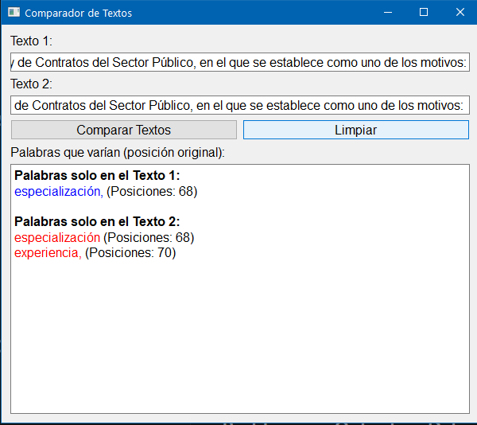

#utilidades/programación 
#python 

Compara dos parrafos y te muestra las diferencias

**Prompt:**
me puedes hacer un script en python con pyqt, que le pueda dar dos textos y que los compare indicando que palabras varian?
quiero que le añades que si la palabra es del primer texto la pongo en azul y si es del segundo texto en rojo, ¿lo puedes añadir al código?
 añade un boton para limpiar los textos pegados y el resultado.
en el resultado, indica tambien ademas de la palabra cambiada, la situación de la misma en el párrafo original
 
**Captura de pantalla:**
  

**Codigo Fuente:**  
