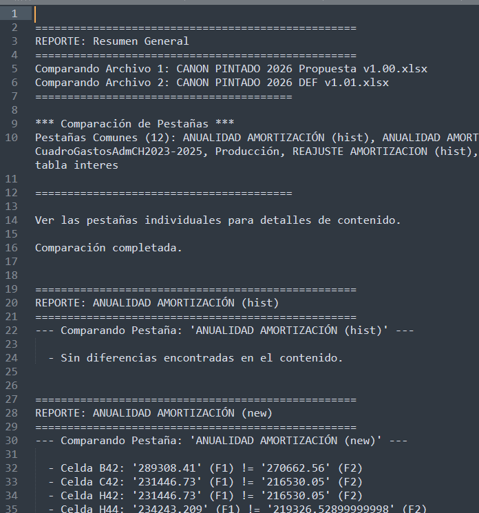
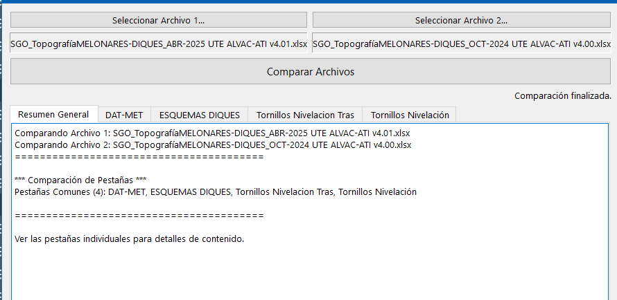
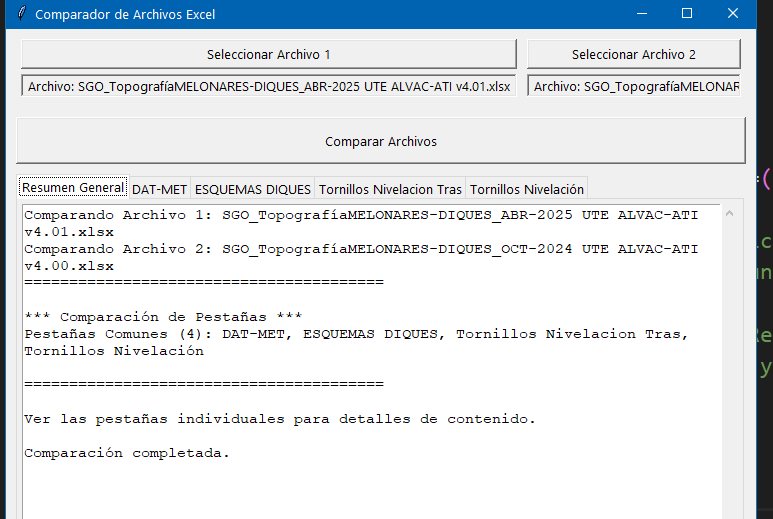
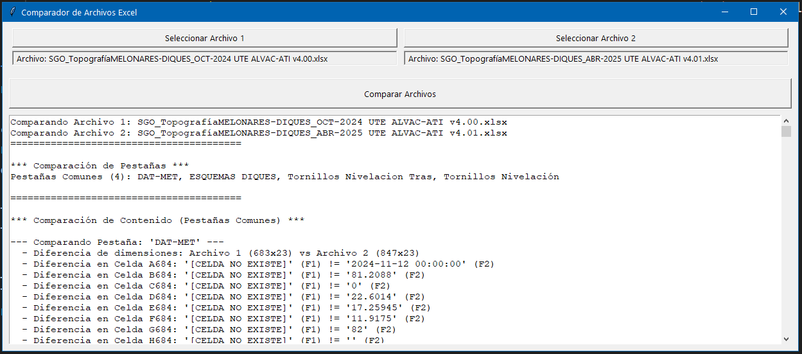

Realizado por: Gemini 2.5
#utilidades/programación 
#python 

### Versión 4: Comparar y hacer informe final en formato txt
'Se le añade al codigo la función de pasar las diferencias que ha encontrado a un unico fichero .TXT'

Extra: [[Como mejorar el código de un programa ya creado con IA añadiendo nuevas funcionalidades)  

**Captura de pantalla:**
  
| pantalla principal                   | salida txt                           |
| ------------------------------------ | ------------------------------------ |
|    |    |

**Código fuente:**   
[descargar](./ANEXOS/comparador_excel_e_informe.py)  

### Version 3: 

**Prompt:**  
Quiero un hagas un script en python con interfaz visual donde:  
- Compara estos dos ficheros los nombres de pestañas y el valor de cada celda  
- Muestre las diferencias en un informe  
- Quiero que le añadas, que por cada pestaña comparada, cree una area de texto con el reporte de diferencias de esa pestaña  
- Quiero que hagas el entorno gráfico con PyQt, en vez de tkinter ¿ podrias convertir el código?  
- No uses threading, ya que me da error  

**Captura de pantalla:**  
  
  

Código fuente: [descargar](./ANEXOS/comparador_excel_pyqt.py)  

### Version 2:

**Prompt:**
Quiero un hagas un script en python con interfaz visual donde:  
- Compara estos dos ficheros los nombres de pestañas y el valor de cada celda  
- Muestre las diferencias en un informe  
- Quiero que le añadas, que por cda pestaña comparada, cree una area de textocon el reporte de diferencias de esa pestaña  

Captura de pantalla:
  

Codigo fuente:
[descargar](./ANEXOS/CompararExcelPorPestañas.py)  

---------------------------
### version 1
**Prompt:**
Quiero un hagas un script en python con interfaz visual donde:    
- Compara estos dos ficheros los nombres de pestañas y el valor de cada celda  
- Muestre las diferencias en un informe  

**Captura de pantalla:**  
  

Código:
[descargar](./ANEXOS/CompararExcel.py)  

