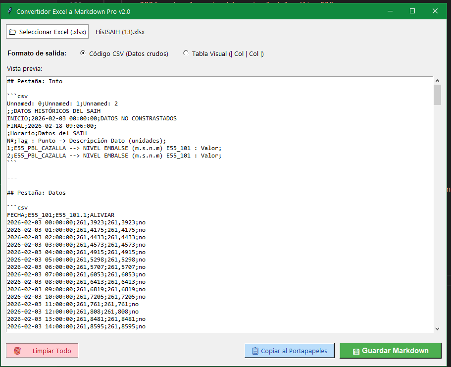

### EXCEL Convertir un EXCEL con todas las pestañas a CSV unido en un unico archivo mardown

**Prompt:**
- haz un script en python que lea un fichero xlsx y convierta todas sus pestañas en formato csv y las una en un único fichero markdown  
- añadele interfaz visual para poder seleccionar el archivo, y mostrar el markdown con botón para guardarlo  
- elegir entre formato CSV o Tabla visual desde la propia interfaz  
- Analiza este programa y Añade a este programa un botón para copiar al portapapeles, y otro boton para limpiar resultados.  
- Analiza este programa y Añade a este programa un botón para copiar al portapapeles, y otro boton para limpiar resultados.  
- Al convertir un numero, el punto decimal conviertelo en coma decimal.  

**Librerias:**
pip install pandas openpyxl  
pip install tabulate  

**Captura:**

**Programa:**
[descargar](./ANEXOS/DeExcel-a-CSV-MK.py)