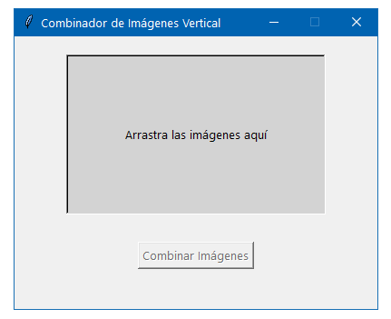

#python 
#utilidades 
#utilidades/programación 

**Uso:** unir varias imágenes en una sola.  

**Nota:** Previamente instalar las librerias siguientes  
``` bash
pip install tkinterdnd2
```

Codigo:
``` python
import tkinter as tk
from tkinter import filedialog
from tkinterdnd2 import DND_FILES, TkinterDnD
from PIL import Image

class ImageCombiner(TkinterDnD.Tk):
    def __init__(self):
        super().__init__()
        self.title("Combinador de Imágenes Vertical")
        self.geometry("400x300")
        self.resizable(False, False)

        self.image_paths = []
        self.label = tk.Label(self, text="Arrastra las imágenes aquí", relief="sunken", width=40, height=10, borderwidth=2, bg="lightgray")
        self.label.pack(pady=20)
        self.label.drop_target_register(DND_FILES)
        self.label.dnd_bind('<<Drop>>', self.drop_handler)

        self.combine_button = tk.Button(self, text="Combinar Imágenes", command=self.combine_images, state=tk.DISABLED)
        self.combine_button.pack(pady=10)

    def drop_handler(self, event):
        file_paths = event.data.split()
        valid_images = [f for f in file_paths if f.lower().endswith(('.png', '.jpg', '.jpeg', '.gif', '.bmp'))]
        if valid_images:
            self.image_paths.extend(valid_images)
            self.label.config(text=f"Imágenes añadidas: {len(self.image_paths)}")
            self.combine_button.config(state=tk.NORMAL)
        else:
            self.label.config(text="Arrastra imágenes aquí (PNG, JPG, JPEG, GIF, BMP)")

    def combine_images(self):
        if not self.image_paths:
            return

        images = [Image.open(path) for path in self.image_paths]
        widths, heights = zip(*(i.size for i in images))

        max_width = max(widths)
        total_height = sum(heights)

        new_image = Image.new('RGB', (max_width, total_height))

        y_offset = 0
        for img in images:
            if img.width < max_width:
                resized_img = Image.new(img.mode, (max_width, img.height), (255, 255, 255))
                resized_img.paste(img, ((max_width - img.width) // 2, 0))
                new_image.paste(resized_img, (0, y_offset))
            else:
                new_image.paste(img, (0, y_offset))
            y_offset += img.height

        save_path = filedialog.asksaveasfilename(defaultextension=".png", filetypes=[("PNG files", "*.png"), ("JPEG files", "*.jpg"), ("All files", "*.*")])
        if save_path:
            try:
                new_image.save(save_path)
                tk.messagebox.showinfo("Éxito", f"Imagen combinada guardada en: {save_path}")
                self.image_paths = []
                self.label.config(text="Arrastra las imágenes aquí")
                self.combine_button.config(state=tk.DISABLED)
            except Exception as e:
                tk.messagebox.showerror("Error", f"No se pudo guardar la imagen: {e}")

if __name__ == "__main__":
    app = ImageCombiner()
    app.mainloop()
```


**Software en funcionamiento:**  
  