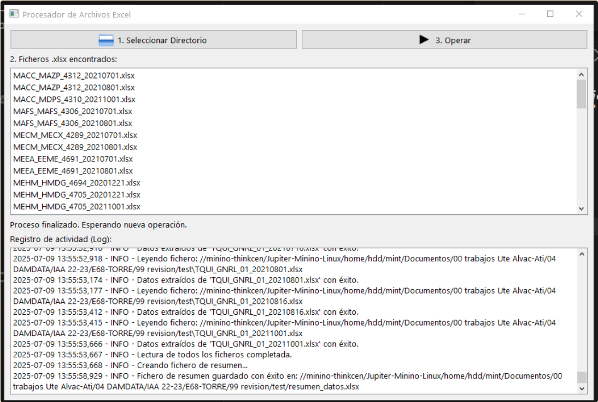

#python 
#excel 
#IAA 
#iac
#utilidades/programación 

**Prompt:**
Quiero que me hagas un script en python, con entorno gráficos realizado con PYQT6 que haga las siguientes tareas:
- Tiene que llevar un registro log de todo lo que se va haciendo
- Que permita seleccionar un directorio
- Muestre en una lista todos los ficheros .xlsx que encuentre en ese directorio.
- Tiene un boton "Operar" que tiene que realizar:
Por cada archivo .xlsx que ha encontrado leer varias celdas:
-celda K4, y la almacene en una lista llamada "Ficha"
-celda D5, y la almacene en una lista llamada "Nombre"
-celda I5, y la almacene en una lista llamada "Periodicidad"
-celda L5, y la almacene en una lista llamada "Realizada"
-debe de ir mostrando en el formulario principal que archivo esta procesando y el numero de archivos que le queda por procesar.
Una vez terminado de leer todos los archivos, con las listas tienes que generar un fichero .xlsx, con la columna "FICHA","NOMBRE","PERIODICIDAD","REALIZADA", y en cada fila que aparezca los datos leidos.
Cuando termine tiene que mostrar un formulario informando que ha terminado de procesar todos los ficheros.
Si se produce un error mientras se ejecute el programa, indicalo en un formulario.

Notas:
1) Librerias a instalar:  pip install PyQt6 openpyxl pandas
2) El codigo inicial que genero dio el error "" Error fatal durante el procesamiento: type object 'QFileDialog' has no attribute 'Options'"", volvio a generarlo corrigiendolo.

**Captura de Pantalla**
    
fichero de salida generado formato xlsx: (debes de actualizar el tamaño de las columnas, para que se vea bien)
(./ANEXOS/Pastedimage20250709140032.png)

**Código Fuente:**
(./ANEXOS/ProcesarListasExcelOT-Sipresas v2.00.py)