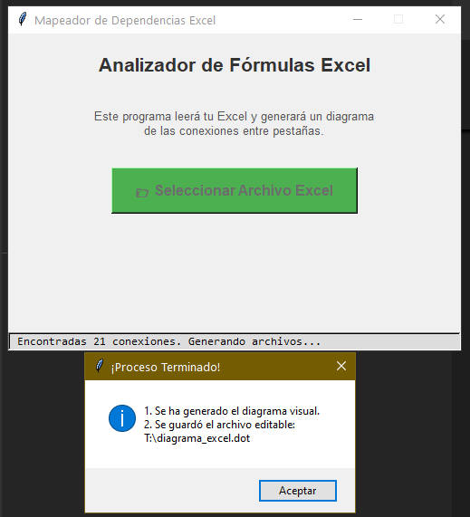
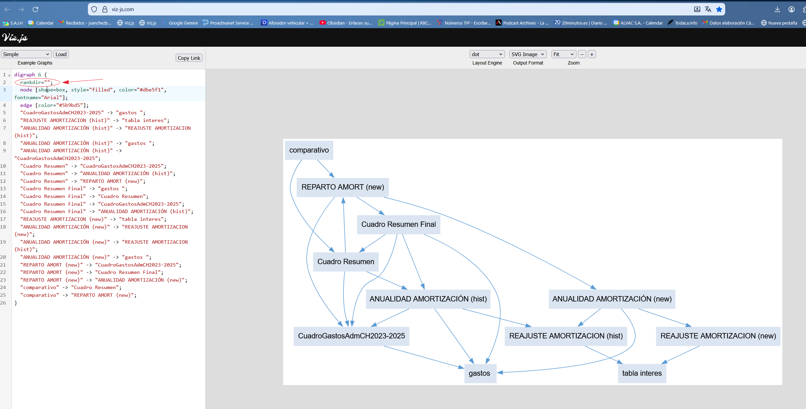

#utilidades/programación 
#python 
#excel 

<span style="background:#b1ffff">Prompt:</span>
Necesito un script en python que haga lo siguiente:
- Interfaz visual 
- Seleccione y lea un fichero excel
- Realizar un diagrama donde se muestre las llamadas de las formulas de una pestaña a otra
- Queria poder modificar el diagrama ¿lo puedes generar de alguna forma o formato que sea editable por otro programa?
- Quiero que le añadas un interfaz visual, donde tenga un boton para seleccionar el fichero excel

<span style="background:#b1ffff">Resultado:</span>
Genera un fichero .dot editable desde visores online como [Edotor.net](https://edotor.net/) o [Viz-js.com](http://viz-js.com/) y una imagen (esta no es editable), por eso es más útil el fichero .dot


<span style="background:#b1ffff">Librerias a instalar previamente:</span>
``` bash
pip install openpyxl networkx matplotlib
```


**Nota instalar las librerias en el python que este usando VS Code:**
Con este script averiguamos la ruta del python que usa Vs Code 
``` python
import sys
print("ESTOY USANDO ESTE PYTHON:", sys.executable)
```
Por ejemplo la salida es:
``` basht
C:\Users\USER\AppData\Local\Microsoft\WindowsApps\PythonSoftwareFoundation.Python.3.11_qbz5n2kfra8p0\python.exe 
```

Y luego para instalar las librerias:
``` bash
C:\Users\USER\AppData\Local\Microsoft\WindowsApps\PythonSoftwareFoundation.Python.3.11_qbz5n2kfra8p0\python.exe  -m pip install openpyxl networkx matplotlib
```


<span style="background:#b1ffff">Salida Programa</span>

| pantallazo                           | fichero .dot                         | 
| ------------------------------------ | ------------------------------------ | 
|    |    |

**Visor del fichero .dot en viz-js.com 
> modifico la linea rankdir="LR" a rankdir="" 
> para que ordene de la forma que más me gusta el resultado
  

Nota: tambien genera el siguiente grafico (pero no es editable)
  

<span style="background:#b1ffff">Código fuente:</span>
  
