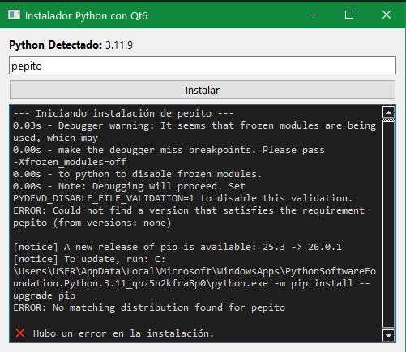

prompt:
 - haz un script en python que detecte que version de python tengo e instale una libreria dada por el usuario
 - quiero que tenga entorno visual qt6
 - añade el programa la salida de terminal para ir informando al usuario de lo que esta pasando durante la instalación

Entorno terminal:
[descargar](./ANEXOS/instalarlibreriaterminal.py)
Entorno interfaz gráfico:

Código:
[descargar](./ANEXOS/instalarlibreriaqt6.py)