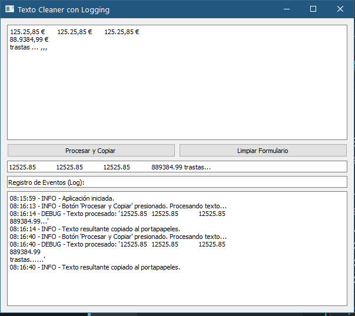

#cronogramas 
#utilidades/programación 
#python 

**Prompt:**  
Haz un script en python con entorno graficos qt5 y que haga lo siguiente:  
- Pueda recibir un texto  
- Cambiar los siguientes caracteres:  
el Espacio " " por nada  
el punto "." por nada  
la coma "," por punto "."  
el signo euro "€" por nada  
- El texto cambiado se pueda copiar al portapapeles  
- Que tenga un boton para limpiar el formulario y poder empezar de cero  
- Que tenga un sistema de logging y que se muestre en el formulario  

**Interfaz:**  

  

**Codigo fuente:**  
[descargar](./ANEXOS/SubCronogramaLogging.py)  