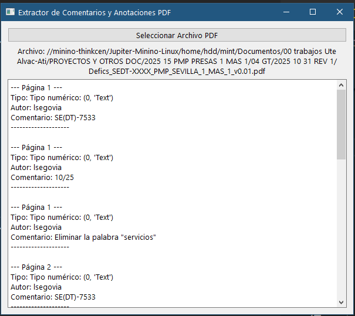

#utilidades/programación 
#python 


**Prompt:**  
Quiero un script en Python con interfaz gráfica pyqt6 que dado un PDF extraiga los comentarios y anotaciones insertados en el pdf  


**Captura de pantalla:**  
  

**Codigo:**  
[descargar](./ANEXOS/Extrae%20comentarios%20y%20anotaciones%20de%20texto%20de%20un%20pdf%20dado.py)  

La linea  
Estaba dando problemas la linea:  
``` python
tipo_anot_str = fitz.PDF_ANNOT_TYPE_NAMES[anot.type]
```

y se cambio por:  
``` python
tipo_anot_str = f"Tipo numérico: {anot.type}"
```


