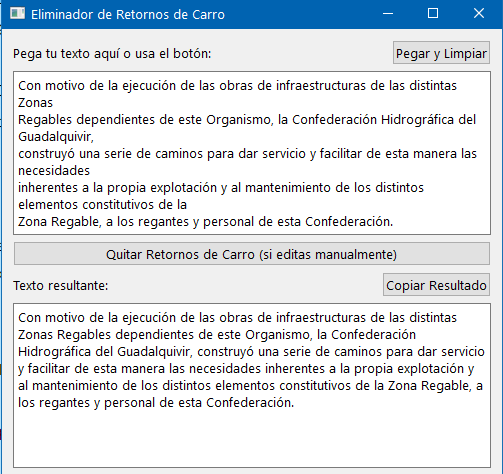

#utilidades/programación 
#python 

**Utilidad:**
Cuando copio un parrafo de un pdf, el parrafo al pegarse se queda como lineas. Este programa elimina los retornos de carro del texto pegado

Prompt:
Quiero un script en python con interfaz visual hecho en pyqt6, que haga lo siguiente: le pueda pegar un texto en el formulario y me devuelva el texto quitando los retornos de carro.
Añadele al código que me has dado un botón para pegar el contenido del portapapeles y otro botón para copiar el contenido del resultado.
Quiero que el boton de Pegar el texto del portapapeles, al darle tambien ejecute la parte de quitar los retornos de carro

**Captura de Pantalla:**
  

**Código:**
![quitarRetornosDeCarroTexto.py)  