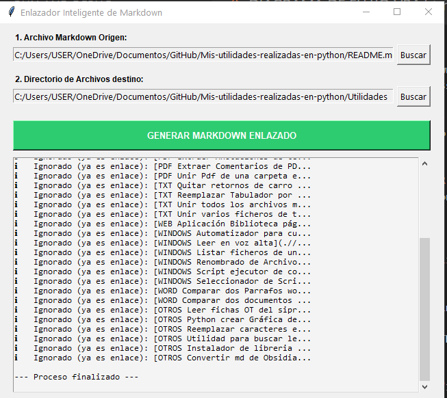

<mark style="background:#b1ffff">Objeto:</mark>  
Lee un fichero de texto plano, y a los elementos de una lista, le asocia un enlace markdown al fichero que tenga nombre parecido.  
Ejemplo de utilidad: para actualizar los enlaces del fichero readme.md  

<mark style="background:#b1ffff">Prompt:</mark>  
Quiero un script en python con entorno visual que:- seleccione un fichero tipo md
- seleccione un directorio
- lee este fichero y obtenga un array de la lista que haya.
- por cada elemento de la lista, busque un fichero con nombre parecido
- cree un fichero de salida con formato markdown, donde escriba el elemento de la lista y su enlace al fichero.
- Añadele que el enlace del fichero cambie el caracter espacio (" ") por "%20"
- Añade una textobox  donde vaya informando sobre el elemento encontrado de la lista y el fichero parecido al que va a enlazarlo.
- Añadir: si el elemento de la lista es un enlace tipo markdown, no hacer nada con ese elemento.

<mark style="background:#b1ffff">Captura de Pantalla:</mark>  

<mark style="background:#b1ffff">Codigo fuente:  </mark>    
[descargar sin usar ia](./ANEXOS/OtrosEnlazadorv2.00.py)   
[descargar con usar ia modelo all-MiniLM-L6-v2 offline](./ANEXOS/OtrosEnlazadorIAv3.00.py)    